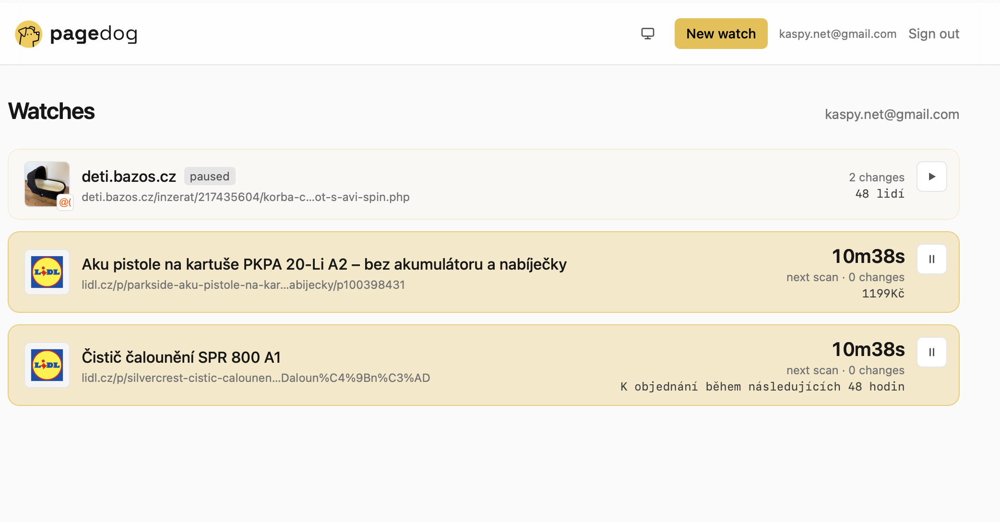
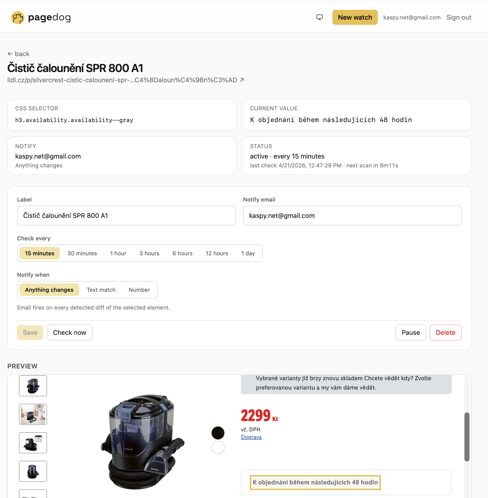

<p align="center">
  
</p>

[](LICENSE)
[](https://nextjs.org)
[](https://vercel.com/new/clone?repository-url=https://github.com/kasparek-net/pagedog)

> This is a template for your own self-hosted instance. **I don't run a public hosted version** — fork it and deploy your own (free on Vercel + Neon + Resend).

Self-hosted website change watcher. Paste a URL, click the element you want to track, and Pagedog checks it every hour. When the text changes, you get an email. Product back-in-stock alerts, price drops, status page changes — without paying Visualping or Distill.io every month.

<p align="center">
  
  <br><br>
  
</p>

## Features

- 🖱 **Visual picker** — hover inside the page preview, click, and the app remembers a unique CSS selector.
- ⏰ **Hourly checks** via GitHub Actions cron (free).
- 📧 **Email notifications** via Resend (3,000 emails/month on the free tier).
- 👥 **Multi-user** — each user has their own watches and notification email. Sign-in is a passwordless magic link (no passwords to store); access is gated by an `ALLOWED_EMAILS` allowlist so only you (or whoever you invite) can sign up.
- 🔒 **Safe defaults** — sandboxed iframe picker, SSRF protection with DNS-rebind check, per-user rate limits, timing-safe cron secret, HMAC-signed session cookies.
- 💸 **Free forever** on Vercel Hobby + Neon free tier + Resend free tier.

## Stack

Next.js 16 (App Router) · TypeScript · Tailwind v4 · Prisma · Postgres · Resend · cheerio. Auth is a small in-house magic-link flow (HMAC-signed tokens, no third-party dependency).

## Quick start (local)

```bash
git clone https://github.com/kasparek-net/pagedog
cd pagedog
npm install
cp .env.example .env
# fill in DATABASE_URL, AUTH_SECRET, ALLOWED_EMAILS, RESEND_API_KEY, CRON_SECRET
npm run db:push          # creates tables in your DB
npm run dev
```

Open <http://localhost:3000>, enter an email from `ALLOWED_EMAILS`, and click the magic link you receive to sign in.

Trigger a check manually:

```bash
curl -X POST http://localhost:3000/api/cron/check \
  -H "Authorization: Bearer $CRON_SECRET"
```

## Deploy to Vercel

1. Fork this repo and connect it to Vercel (or click "Deploy on Vercel" above).
2. Vercel Marketplace → add **Neon Postgres** and **Resend** (env vars are wired automatically).
3. Add the remaining env vars in Vercel → Project → Settings → Environment Variables:
   - `AUTH_SECRET` (`openssl rand -hex 32`) — HMAC key for magic links and sessions
   - `ALLOWED_EMAILS` — comma-separated list of emails allowed to sign in
   - `CRON_SECRET` (`openssl rand -hex 32`) — bearer token for `/api/cron/check`
   - `APP_URL` (e.g. `https://pagedog.vercel.app`) — used in emailed links
   - `RESEND_FROM` — sender identity, e.g. `Pagedog <noreply@yourdomain.tld>`
4. After the first deploy: `vercel env pull && npm run db:push`.
5. GitHub repo → Settings → Secrets and variables → Actions → add `APP_URL` and `CRON_SECRET`. The `.github/workflows/cron.yml` workflow will then hit `/api/cron/check` every hour.

## Auth flow

- Visit `/sign-in`, enter your email → `POST /api/auth/request` checks `ALLOWED_EMAILS`, mints a HMAC-signed magic token (15 min TTL), and emails the link via Resend.
- The link goes to `GET /api/auth/verify?token=…`, which verifies the HMAC and sets a signed session cookie (`pd_session`) valid for one year with rolling renewal.
- No passwords are stored. No third-party auth SDK. If `AUTH_SECRET` is rotated, all existing sessions are invalidated.

## How the picker works

- `/watches/new` → paste a URL → the server fetches HTML, sanitizes it (no `<script>`, `<form>`, `on*` attributes, no `<iframe>`), injects `<base href>` and `/picker.js`.
- HTML is rendered into `<iframe srcdoc>` with `sandbox="allow-scripts"` (no `allow-same-origin` = isolated from your session, no cookie access).
- Inside the iframe `picker.js` outlines elements red on hover; on click it computes a unique CSS selector and sends it to the parent via `postMessage`.

Limitation: client-rendered SPAs (React/Vue) don't hydrate inside the sandboxed iframe — the picker works on server-rendered HTML. For advanced cases you can type the selector manually.

## Cron flow

1. GitHub Actions (hourly) → `POST /api/cron/check` with a bearer token.
2. The endpoint loads all active watches and fetches them in parallel (concurrency 5) using cheerio to extract the selected element.
3. It hashes the extracted text (SHA-256). If the hash differs from `lastHash`, it creates a `Change` row and sends an email via Resend.

## Security

- Sign-in is gated by `ALLOWED_EMAILS` — emails not on the list are rejected at `/api/auth/request` (403). Keep this list short.
- Magic-link tokens are HMAC-signed (`AUTH_SECRET`), scoped to an email, and expire after 15 minutes. Session cookies use the same HMAC, `httpOnly` + `SameSite=Lax`, and are rotated when they near expiry.
- `/api/preview` and `POST /api/watches` are rate-limited per user; `/api/auth/request` is rate-limited per IP.
- The URL fetcher (`/api/preview`, watch creation, cron) blocks private IP ranges and localhost — a DNS lookup runs before the fetch to defeat DNS rebinding.
- The iframe picker runs with `sandbox="allow-scripts"` (no `allow-same-origin`) — no access to user session.
- `CRON_SECRET` is compared timing-safely. Without it set, the endpoint returns 503.
- Per-user watch count cap (`MAX_WATCHES_PER_USER`, default 50).

Report security issues as described in [SECURITY.md](SECURITY.md).

## Contributing

PRs welcome. CI runs on every push (typecheck + build). There are no tests yet — if you add some, great.

Smaller changes: open a PR directly. Larger (refactor, new provider, different DB driver): open an issue first to discuss the approach.

## License

[MIT](LICENSE) © Jakub Kašpárek and contributors.

Use at your own risk.
